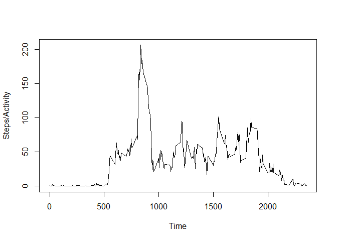

# Reproducible Research: Peer Assessment 1

## Loading and preprocessing the data
We download the files, put it in the folder "/data", unzip it and read it into the data set "activity"; furthermore we convert the factor variable date to an honest date variable.


```r
setInternet2(use = TRUE)
url <- "https://d396qusza40orc.cloudfront.net/repdata%2Fdata%2Factivity.zip"
if (!file.exists("data")){dir.create("data")}
curdir <- getwd()
setwd(paste(curdir,"/data/",sep=""))
download.file(url,destfile="data.zip")
unzip("data.zip")
activity <- read.csv("activity.csv",header=TRUE)
setwd(curdir)
activity$date <- as.Date(activity$date)
```


## What is mean total number of steps taken per day?
Now we start the actual analysis of the data: firstly we look at the number of steps taken per day in a histogramm

```r
library(ggplot2)
stepsday <- aggregate(activity$steps,by=list(activity$date),FUN=sum,na.rm=TRUE)
colnames(stepsday) <- c("date","steps")
hist(stepsday$steps,xlab="",ylab="Total number of steps per day",breaks=20)
```

 
  
Secondly, we want to report the mean and median number of steps taken per day:

```r
x <- mean(stepsday$steps,na.rm=TRUE)
y <- median(stepsday$steps,na.rm=TRUE)
mm <- data.frame("mean"=x,"median"=y)
mm
```

```
##      mean median
## 1 9354.23  10395
```


## What is the average daily activity pattern?
Now, we want to see if there is a pattern in the daily activity. For that, we compute the mean number of steps for each time interval, where the mean is taken over the different days.

```r
dailyact <- aggregate(activity$steps,by=list(activity$interval),FUN=mean,na.rm=TRUE);
colnames(dailyact) <- c("Time","Steps")
plot(dailyact$Time,dailyact$Steps,type="l",xlab="Time",ylab="Steps/Activity")
```

 

Now, we find the interval in which the maximum daily activity occurs.

```r
maxind <- which.max(dailyact$Steps)
maxtime <- dailyact$Time[maxind]
maxact <- max(dailyact$Steps)
m <- data.frame("MaxTime"=maxtime,"MaxAct"=maxact)
m
```

```
##   MaxTime   MaxAct
## 1     835 206.1698
```

## Imputing missing values
The first task consists of just computing the number observations in which some value is missing:

```r
activityNoNa <- na.omit(activity)
dim(activity)[1]-dim(activityNoNa)[1]
```

```
## [1] 2304
```

Now, we replace the missing values by the mean of the respective time interval:

```r
actImpute <- activity
actImpute$steps[which(is.na(activity$steps))] <- as.vector(replicate(8,dailyact$Steps))
```

To check that we've done everything right, we compare whether the missing intervals are really just an eight-fold repetition of the daily intervals:

```r
 all(as.vector(replicate(8,dailyact$Time))==activity$interval[which(is.na(activity$steps))])
```

```
## [1] TRUE
```

Next, we make a histogram of the total number of steps taken per day for the data frame with the imputed values:

```r
stepsday2 <- aggregate(actImpute$steps,by=list(actImpute$date),FUN=sum,na.rm=TRUE)
colnames(stepsday2) <- c("date","steps")
hist(stepsday2$steps,xlab="",ylab="Total number of steps per day",breaks=20)
```

 
 
 We compare the mean and median of the total number of steps per day without imputed values (first line) with the mean and median of the total number of steps per day with imputed values (second line):
 

```r
x <- mean(stepsday2$steps,na.rm=TRUE)
y <- median(stepsday2$steps,na.rm=TRUE)
mm2 <- data.frame("mean"=x,"median"=y)
rbind(mm,mm2)
```

```
##       mean   median
## 1  9354.23 10395.00
## 2 10766.19 10766.19
```

As one can see from these numbers, our strategy of imputing step values increases both the mean and the median of the total number of steps taken per day.


## Are there differences in activity patterns between weekdays and weekends?
We generate a new variable that just tells us if we are on a weekend or a weekday.

```r
actImpute$wkd <- weekdays(actImpute$date)
actImpute$wkend <- factor(rep(NA,length(actImpute$wkd)),levels=c("weekend","weekday"))
actImpute$wkend[actImpute$wkd %in% c("Saturday","Sunday")] <- "weekend"
actImpute$wkend[actImpute$wkd %in% c("Monday","Tuesday","Wednesday","Thursday","Friday")] <- "weekday"
```

Now we want to use this new variable to compare the activity patterns on weekends and weekdays:

```r
actwkend <- actImpute[actImpute$wkend=="weekend",c(1,2,3)]
actwkday <- actImpute[actImpute$wkend=="weekday",c(1,2,3)]
actwkendagre <- aggregate(actwkend$steps,by=list(actwkend$interval),FUN=sum)
actwkdayagre <- aggregate(actwkday$steps,by=list(actwkday$interval),FUN=sum)
colnames(actwkendagre) <- c("Interval","Steps"); colnames(actwkdayagre) <- c("Interval","Steps")
plot(actwkdayagre$Interval,actwkdayagre$Steps,xlab="Interval",ylab="Steps",type="l",col="red")
lines(actwkendagre$Interval,actwkendagre$Steps,xlab="Interval",ylab="Steps",type="l")
legend("topright",c("Weekday","Weekend"),col=c("red","black"),lty=c(1,1))
```

 

Some differences are visible: the person seems to get up earlier on weekdays and takes a relatively long walk in the morning. There are three (or four) more periods in which the subject is more active during weekdays. In general, the number of steps is quite a lot less on weekends than on weekdays.
